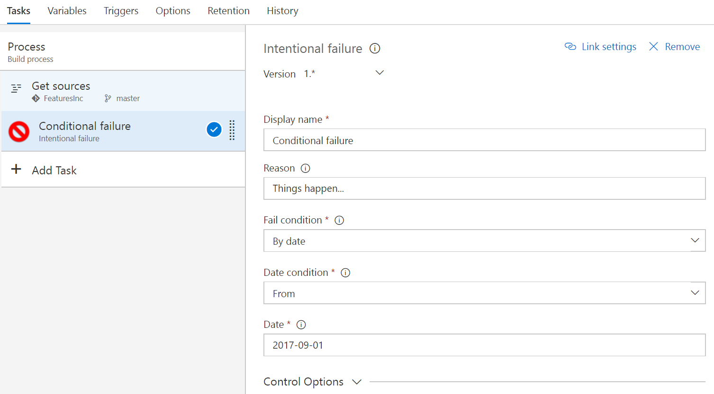

# Fail a build or release based on various conditions #

Simplest use case for the Fail task is demo and testing purposes. It is a simple straight forward way to show what it look like when a build fails and how this information is communicated (alerts, dashboard etc) without intentionally checking in bad code or misconfigure an existing build/release template.

The Fail task can also be used to ensure a build/release is not (successfully) run before or after a certain date (typically planning, legal or licensing reasons) or to fail a build/release based on output variables from multiple previous tasks even though each of those individual tasks passed.

Supported failure conditions:
- Always
- By date
- By expression

### Usage ###

Add a new task and select **Fail** from the **Utility** catagory and configure as needed.

Parameters:
 - **Fail condition**: Select condition for failure. "Always", "By date" or "By expression".
 - **Reason**: Specify why the Fail task is used. Others might not know...
 - **Date condition**: Fail before or from the specified date.
 - **Date**: Date to use.
 - **Expression**: Powershell command which evaluates to true or false. 

### Details

- Default mode for the task is to fail. If the specified date or expression cannot be resolved the task will always fail.
- Date must be in yyyy-MM-dd format.
- Expression must be a valid expression for the PowerShell Invoke-Expression cmdlet.
- An error or warning will be logged depending on if failure condition is triggered or not.
